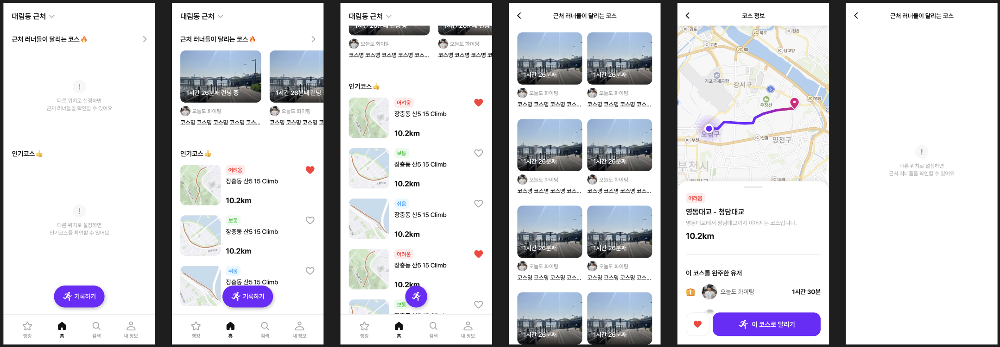
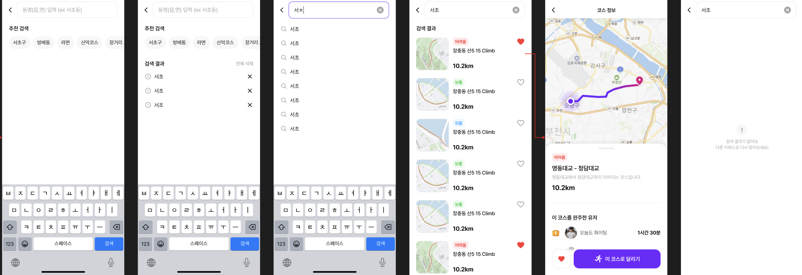
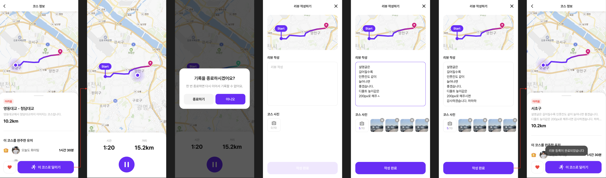
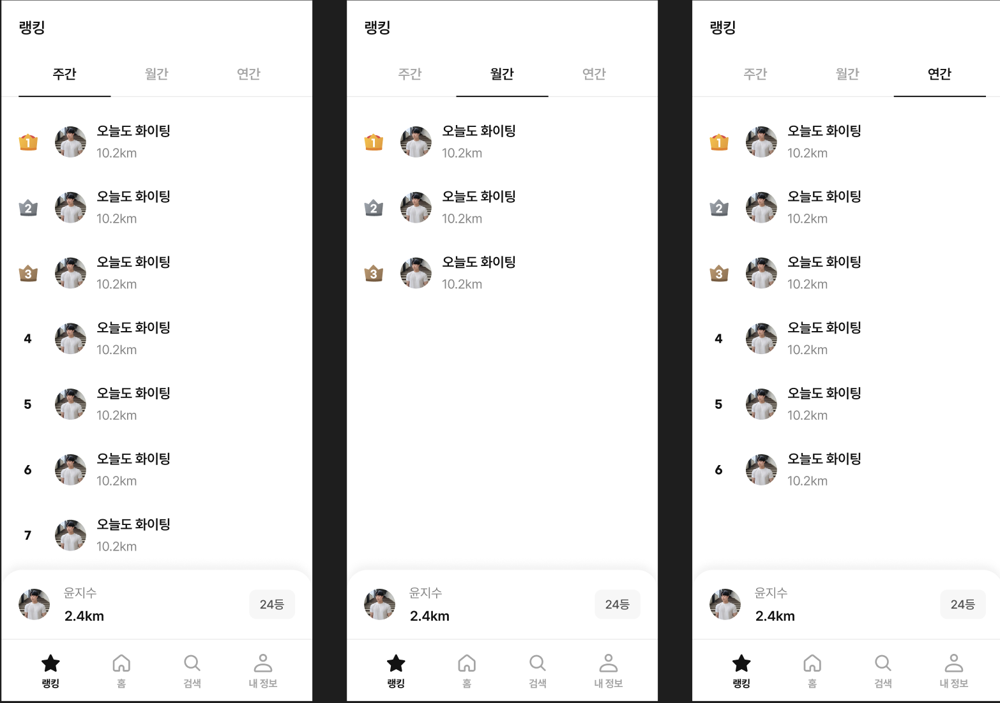
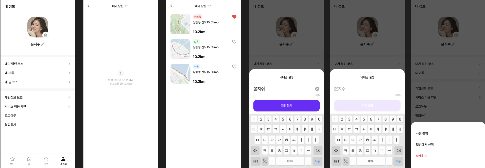
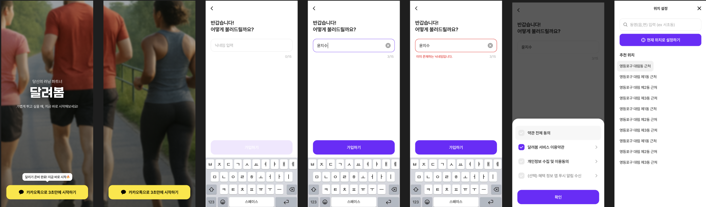

# 달려봄 (Dallyeobom) - Backend

> 2025 한국 관광데이터 공모전 출품작

공공 데이터 기반 사용자 참여형 러닝 코스 추천 플랫폼



---

## 프로젝트 소개

**달려봄**은 한국관광공사의 두루누비 API를 활용해 매월 전국 5대 권역에서 거리, 난이도, 경관을 고려한 숲길과 강변 중심의 러닝 코스를 자동 추천하는 사용자 참여형 플랫폼입니다.

포스트 팬데믹 시대를 맞아 건강과 야외활동에 대한 관심이 크게 증가하고 있습니다. 특히 러너들은 아름다운 경관과 독특한 경험을 제공하는 러닝 코스를 선호하지만, 신뢰도 높은 정보를 얻기 어려워 개인적인 노력만으로는 만족스러운 장소를 찾기 어렵습니다.

**달려봄**은 이러한 문제를 해결하고자:
- 공공데이터를 활용한 신뢰성 높은 러닝 코스 제공
- GPS 기반 러닝 인증 및 기록 시스템
- 리뷰, 순위 경쟁 등 커뮤니티 활동을 통한 러닝 문화 조성
- 지역 관광 활성화 및 공공데이터 활용 확산

을 목표로 합니다.

---

## 주요 기능

### 1. 러닝 코스 탐색



- **근처 코스 검색**: 사용자 위치 기반 반경 내 러닝 코스 검색 (Oracle Spatial)
- **인기 코스 추천**: 완주자 수, 좋아요 기반 추천
- **코스 상세 정보**: 거리, 난이도, 경로, 완주자 수, 리뷰 등 상세 정보 제공
- **코스 좋아요**: 관심 코스 저장 기능

### 2. GPS 기반 러닝 기록




- **실시간 GPS 추적**: 러닝 경로 실시간 기록
- **완주 인증**: GPS 기반 코스 완주 인증
- **인증샷 업로드**: 완주 기록당 최대 3개 이미지 업로드
- **리뷰 작성**: 코스에 대한 평가 및 후기 작성
- **개인 코스 생성**: 완주한 경로를 새로운 공개 코스로 등록

### 3. 랭킹 시스템



- **주간/월간/연간 랭킹**: 기간별 러너 순위 확인
- **완주 거리 기준 랭킹**: 누적 완주 거리 기반 경쟁
- **코스별 랭킹**: 특정 코스 완주자 순위

### 4. 마이페이지



- **프로필 관리**: 닉네임, 프로필 이미지 설정
- **내가 달린 코스**: 완주한 코스 목록 및 기록 조회
- **찜한 코스**: 좋아요한 코스 목록
- **러닝 기록 관리**: 완주 기록 수정 및 삭제

### 5. 회원 인증



- **카카오 소셜 로그인**: 간편한 카카오 계정 연동
- **JWT 기반 인증**: Access Token + Refresh Token
- **약관 동의 관리**: 필수/선택 약관 검증 및 동의 이력

---

## 기술 스택

### Backend
| 구분         | 기술                        |
|------------|---------------------------|
| Language   | Kotlin 2.1.21             |
| Framework  | Spring Boot 3.5.0         |
| Runtime    | Java 21 (Eclipse Temurin) |
| Build Tool | Gradle 8.14.1 (KTS)       |

### Database & ORM
| 구분            | 기술                                 |
|---------------|------------------------------------|
| Database      | Oracle Database                    |
| ORM           | Hibernate 6.6.15 + Spring Data JPA |
| Spatial Data  | Hibernate Spatial                  |
| Query Builder | Kotlin JDSL 3.5.5                  |

### Infrastructure
| 구분                | 기술                        |
|-------------------|---------------------------|
| Cache & Lock      | Redisson 3.51.0 (Redis)   |
| Cloud Storage     | AWS S3                    |
| Config Management | AWS Parameter Store       |
| Container         | Google Jib 3.4.5 (Docker) |
| Orchestration     | Kubernetes                |

### Security
| 구분             | 기술                  |
|----------------|---------------------|
| Authentication | Spring Security 6.x |
| Token          | JWT (jjwt 0.12.6)   |
| OAuth2         | Kakao Social Login  |

### External APIs
| 구분          | 용도          |
|-------------|-------------|
| 두루누비 API    | 러닝 코스 데이터   |
| Kakao API   | 소셜 로그인      |
| Google Maps | 지도 서비스      |
| Firebase    | 푸시 알림 (FCM) |

---

## 시스템 아키텍처

```
┌─────────────────────────────────────────────────────────────────┐
│                         Client (Mobile App)                     │
└─────────────────────────────────┬───────────────────────────────┘
                                  │
                                  ▼
┌─────────────────────────────────────────────────────────────────┐
│                      Kubernetes Ingress                         │
└─────────────────────────────────┬───────────────────────────────┘
                                  │
                                  ▼
┌─────────────────────────────────────────────────────────────────┐
│                    Spring Boot Application                      │
│   ┌──────────────┐  ┌──────────────┐  ┌──────────────┐          │
│   │   Auth API   │  │  Course API  │  │  User API    │          │
│   └──────────────┘  └──────────────┘  └──────────────┘          │
│   ┌──────────────┐  ┌──────────────┐  ┌──────────────┐          │
│   │  Record API  │  │ Ranking API  │  │  Search API  │          │
│   └──────────────┘  └──────────────┘  └──────────────┘          │
└───────┬─────────────────┬─────────────────┬─────────────────────┘
        │                 │                 │
        ▼                 ▼                 ▼
┌───────────────┐ ┌───────────────┐ ┌───────────────┐
│ Oracle DB     │ │ Redis         │ │ AWS S3        │
│ (Spatial)     │ │ (Cache/Lock)  │ │ (Storage)     │
└───────────────┘ └───────────────┘ └───────────────┘
```

---

## 프로젝트 구조

```
kr.dallyeobom/
├── config/                     # 설정 클래스
│   ├── properties/             # 설정 프로퍼티
│   ├── security/               # Spring Security 설정
│   └── swagger/                # API 문서화 설정
│
├── controller/                 # REST API 엔드포인트
│   ├── auth/                   # 인증 관련 API
│   ├── user/                   # 사용자 관련 API
│   ├── course/                 # 코스 관련 API
│   ├── courseCompletionHistory/# 완주 기록 API
│   └── userRanking/            # 랭킹 API
│
├── service/                    # 비즈니스 로직
│   ├── UserService
│   ├── CourseService
│   ├── CourseCompletionHistoryService
│   └── UserRankService
│
├── repository/                 # 데이터 접근 계층
├── entity/                     # JPA 엔티티
├── dto/                        # 데이터 전송 객체
├── client/                     # 외부 API 클라이언트
├── exception/                  # 예외 처리
└── util/                       # 유틸리티 클래스
```

---

## API 엔드포인트

### 인증 (Auth)
| Method | Endpoint                      | Description |
|--------|-------------------------------|-------------|
| POST   | `/api/v1/auth/login/kakao`    | 카카오 로그인     |
| POST   | `/api/v1/auth/user/kakao`     | 신규 사용자 생성   |
| GET    | `/api/v1/auth/check-nickname` | 닉네임 중복 검사   |
| GET    | `/api/v1/auth/terms`          | 약관 목록 조회    |
| POST   | `/api/v1/auth/refresh`        | 토큰 갱신       |

### 코스 (Course)
| Method | Endpoint                      | Description |
|--------|-------------------------------|-------------|
| GET    | `/api/v1/course/nearby`       | 근처 코스 검색    |
| GET    | `/api/v1/course/{id}`         | 코스 상세 조회    |
| POST   | `/api/v1/course/{id}/like`    | 코스 좋아요 토글   |
| GET    | `/api/v1/course/{id}/rank`    | 코스 완주자 랭킹   |
| POST   | `/api/v1/course/{id}/running` | 러닝 시작       |

### 완주 기록 (Course Completion)
| Method | Endpoint                                 | Description |
|--------|------------------------------------------|-------------|
| POST   | `/api/v1/course-completion-history`      | 완주 기록 생성    |
| GET    | `/api/v1/course-completion-history/{id}` | 완주 기록 조회    |
| PATCH  | `/api/v1/course-completion-history/{id}` | 완주 기록 수정    |
| DELETE | `/api/v1/course-completion-history/{id}` | 완주 기록 삭제    |

### 랭킹 (Ranking)
| Method | Endpoint            | Description |
|--------|---------------------|-------------|
| GET    | `/api/v1/user-rank` | 사용자 랭킹 조회   |

---

## 공공데이터 활용

본 서비스는 **한국관광공사의 '두루누비 정보 서비스' Open API**를 활용합니다.

### 활용 데이터
- **코스 목록 정보 조회 API**: 전국 러닝 코스 수집
- **코스 상세 정보**: 코스명, 거리, 난이도, 소요시간, 관광 포인트

### 데이터 처리
1. GPX 파일 기반 코스 경로 파싱
2. 거리, 난이도, 유형(숲길/강변) 기준 필터링
3. 매월 권역별 베스트 코스 자동 선정
4. 사용자 피드백 기반 추천 알고리즘 고도화

---

## 서비스 차별성

| 기존 러닝 앱       | 달려봄                  |
|---------------|----------------------|
| 개인 운동 기록 중심   | 커뮤니티 중심 콘텐츠          |
| 사용자가 코스 직접 탐색 | 공공데이터 기반 자동 추천       |
| 단순 기록 저장      | GPS 인증 + 리뷰 + 랭킹 시스템 |
| 제한된 코스 정보     | 매월 새로운 코스 제공         |

---

## 실행 방법

### 사전 요구사항
- Java 21+
- Oracle Database
- Redis
- AWS S3 버킷
- Kakao Developers 앱 등록

### 환경 설정
1. AWS Parameter Store에 설정값 등록 (`/config/Dallyeobom`)
2. 또는 `application-*.yml` 파일에 직접 설정

### 빌드 및 실행
```bash
# 빌드
./gradlew build

# 실행
./gradlew bootRun

# Docker 이미지 빌드 (Jib)
./gradlew jibDockerBuild
```

### API 문서
서버 실행 후 Swagger UI에서 API 문서 확인:
```
http://localhost:8080/swagger-ui.html
```

---

## 팀 정보

**2025 한국 관광데이터 공모전 출품작**
